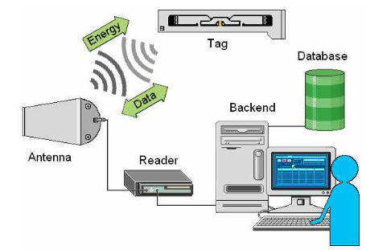
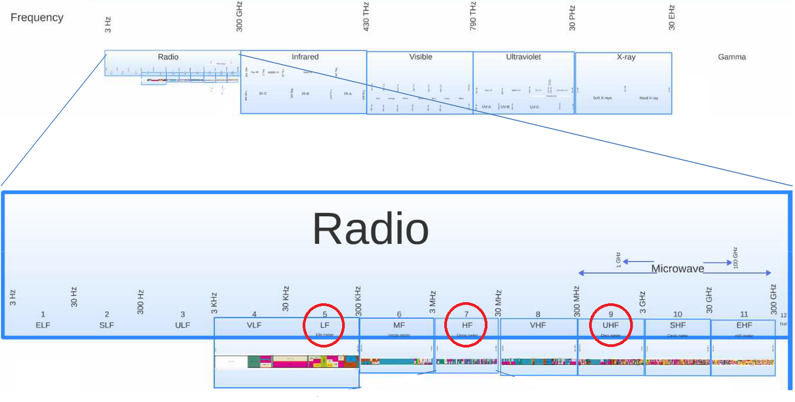
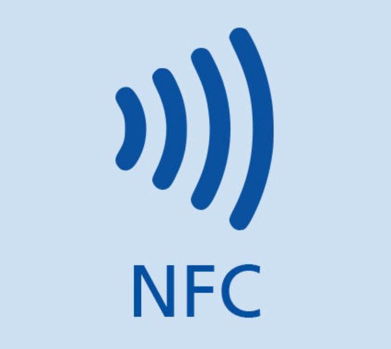

# Radio Frequency IDentification (RFID)

Technologie d'identification utilisant la communication par ondes radioélectriques.

Les **tags** (marqueurs) RFID correspondent à un **couple puce électronique / antenne**, apposé sur un produit permettant l'**identification à distance** grâce à un lecteur qui capte les informations contenues dans la puce. Ces tags peuvent être de deux types : **actif** ou **passif**.

*Exemple : numéro de produit, numéro de lot, description sommaire...*

## 1. Les catégories de tags

### 1.1. Tags actifs

Tout d'abord, il y a les **tags actifs** qui sont **munis d'une batterie interne** qui fournit constamment en courant la puce, et permet l'amplification de l'émission (allant de dizaines de mètres à quelques centaines). Ces derniers ont l'avantage d'avoir une **distance de lecture** plus **importante** donc, une **plus grande capacité mémoire**, et un **temps de réponse plus rapide**. Cependant, la durée de vie du tag dépend de la durée de vie de la batterie.

*Exemple : Transpondeurs d'avion, systèmes Bluetooth Low Energy (BLE)...*

### 1.2. Tags passifs

Les **tags passifs** quant à eu n'ont **pas de batterie**, c'est le signal électromagnétique émis par le lecteur qui permet au tag de fonctionner par **induction** de courant. Lorsque le courant induit est suffisant, la puce est correctement alimentée et transmet l'information. Du fait de l'absence de batterie, la **distance d'émission est plutôt courte** (quelques mètres)

*Exemple : Anti-vol de supermarché...*

### 1.3. Tags semi-actifs

Il existe de plus des tags dits **semi-actifs**, qui sont des **tags actifs nécessitant une action humaine** pour émettre l'information.

### 1.4. Tags semi-passifs

De même, les tags dits **semi-passifs** sont des tags ayant une **source d'énergie interne**, cependant elle n'est **utilisée que pour le fonctionnement de la puce**, et non pas pour l'émission d'information

### 1.5. Tags dits "battery-powered"

Il existe des tags actifs pouvant être mis en mode silencieux et réactivés plus tard lorsque ceux-ci reçoivent un signal de lecteur. Il est donc plus précis de les appeler **tags battery-powered**. Ils ont donc une source d'énergie pour constamment alimenter la puce, mais peuvent être programmés de manière à économiser la batterie, en ne l'activant que sous certaines conditions, ou à intervales réguliers. Ainsi, ces tags peuvent **incorporer un ou plusieurs autre capteurs**, relevant humidité, température, choc, vibrations...

## 2. Les mémoires de tags

Une autre distinction peut être faite entre les tags suivant leur mémoire. Les tags peuvent donc être classés comme **read-only** (lecture seule), **Write One Read Many** (WORM) ou **read/write** (ré-inscriptible)

### 2.1 Mémoire Read-only

Les tags à mémoire **lecture seule** sont typiquement des **tags passifs**, semblables à des codes barres, comportant **peu d'information**, avec une **mémoire non modifiable** à moins de reconfigurer la puce électroniquement. Ces tags sont disponibles en différentes versions : à distance de lecture, nombre de bits de données, et température de fonctionnement variants.

### 2.2 Mémoire WORM

Les tags à mémoire **WORM** (trad : écrite une fois, lue plusieurs fois) permettent d'être **vendus vierge**, afin que l'acheteur puisse y mettre ses propres données, mais une fois ces données inscrites, le tag devient un tag Read-only.

### 2.3. Mémoire Read/Write

Les tags à mémoire **ré-inscriptible** fonctionnent de la même manière qu'une mémoire disque, car les données peuvent être éditées, supprimées, de nouvelles peuvent être ajoutées un nombre illimité de fois.

## Bandes fréquence

En plus des différents types de tags, les systèmes RFID varient suivant la **fréquence** à laquelle ils fonctionnent. Les quatre bandes de fréquence radio primaire, allant de 30 kHz à 5.8 GHz, sont les basses fréquences, les hautes fréquences, les ultra hautes fréquences, et les fréquences micro-onde.  

Pour communiquer, tag et lecteur doivent être sur la même plage de fréquences, ainsi parmi les étiquettes passives, on retrouve trois familles de fréquences :

- les fréquences basses (125-135 kHz)
- la fréquence haute (13.56 MHz)
- les fréquences ultra hautes UHF (865-928 MHz)

Le choix de la **fréquence** dépend de l'**application**, de la **taille du tag**, et de la *distance de lecture* de ce dernier. En général, plus la fréquence est haute, plus les échanges sont rapides, et plus c'est cher.

### Basse fréquence

Dans la gamme des **basses fréquences** (30-300kHz), seule la bande de **125 à 135 kHz** est utilisée en RFID. Cette bande de fréquence est généralement utilisée avec des **tags passifs** avec de **courtes distances de lecture** (quelques centimètres), et à **moindre coût**. À cette fréquence, les tags fonctionnent généralement bien même dans un contexte humide (pluie), et aux alentours de métaux.

*Exemple : contrôle d'accès, identification animale, suivi des actifs...*

### Haute fréquence

Les **hautes fréquences** (3-30 MHz) sont souvent réduites à la seule fréquence : **13.56 MHz**. Cette fréquence permet un **échange de données rapide** malgré le fait qu'en pratique les tags utilisés sont généralement passifs, et une **distance de lecture allant jusqu'à 1 mètre**. Cette fréquence assure une certaine **robustesse face aux éléments** environnementaux, tels que l'eau ou la poussière.

*Exemple : bibliothèques, manufactures pharmaceutiques, e-passeport...*

### Ultra haute fréquence

Les **tags passifs** varient entre **865-868 MHz en Europe**, et **902-928 MHz aux Etats-Unis**, tandis que les **tags actifs varient entre 315-433 MHz**. Les ultra hautes fréquences permettent une **distance de lecture plus importante** (3 à 6 mètres pour les tags passifs, plus de 30 mètres pour les tags actifs) ainsi qu'un **débit plus conséquent** que les bandes précédentes.

*Exemple : très utilisé en supply-chain...*

### Complément

Type de féquence|Fréquence de fonctionnement|Distance de lecture (m)|Taux de transfert|Technologies|Normes
:-:|:-:|:-:|:-:|:-:|:-:
Basse fréquence|125-135 kHz|0,5|1 kb/s|EM4102/4200, EM4450/4550, TEMIC AT5567/AT5577, Hitag 1, Hitag 2, Hitag S2048|ISO 142231, ISO 18000-2
Haute fréquence|13,56 MHz|1|25 kb/s|Mifare Classic 1k/4k, Mifare Ultralight, Mifare DESfire EV1/EV2, NTAG...|ISO 14443, ISO 15693, ISO 18000-3
Ultra haute fréquence|865-868 MHz (EU), 902-928 MHz (US)|3-6|28 kb/s||ISO 18000-6

De plus, lorsque l'émission se fait à très haute fréquence, on parle de **champ lointain**, sinon on se situe dans le **champ proche**. Dans le cas du champ lointain, le tag et le lecteur utilisent la **composante électrique** de l'onde radio, tandis que dans le cas du champ proche, c'est la **composante magnétique**.

## Near Field Communication (NFC)

Le **NFC** (Near Field Communication), soit communication en champ proche, est donc un sous-ensemble particulier de la RFID. Il consiste à communiquer à **haute fréquence** (à **13.56MHz**), afin d'**échanger des données** de manière fluide et rapide. Ce qui séduit, c'est la **distance de lecture** (de l'ordre de quelques centimètres), assurant une **sécurité** supplémentaire.

*Exemple : Avec un smartphone NFC vous pouvez payer ou prendre les transports en commun, simplement parce que le smartphone émule la carte à puce sans contact à 13.56MHz qu'attend le terminal de paiement ou le valideur.*

Ainsi, le NFC est le RFID utilisent la même technologie, mais pour deux activités différentes.

----

## Sources

<https://ela.fr/rfid-active-vs-rfid-passive-quelles-differences.html>

<https://www.futura-sciences.com/tech/definitions/tech-rfid-4187/>

<https://www.springcard.com/fr/blog/news/what-is-the-difference-between-rfid-and-nfc>

<https://www.frandroid.com/comment-faire/comment-fonctionne-la-technologie/237303_lenfc-2>

<https://www.digitaltrends.com/mobile/what-is-nfc/>

<https://cdn.intechopen.com/pdfs/6177.pdf>

<https://www.barcoda.fr/content/33-mieux-comprendre-la-technologie-rfid>