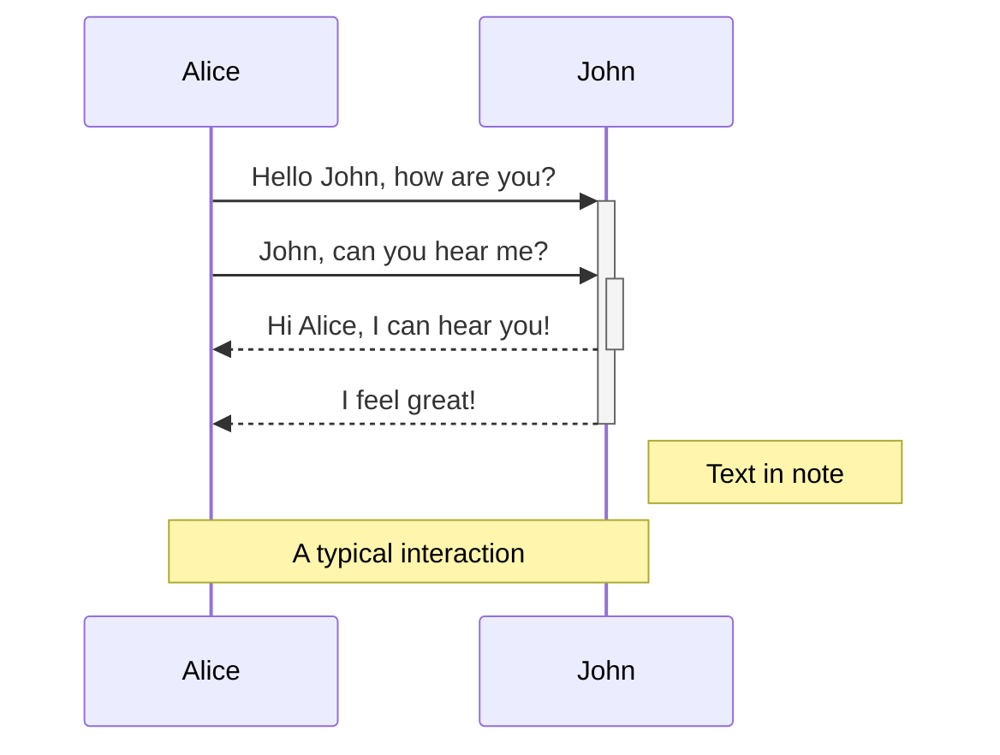
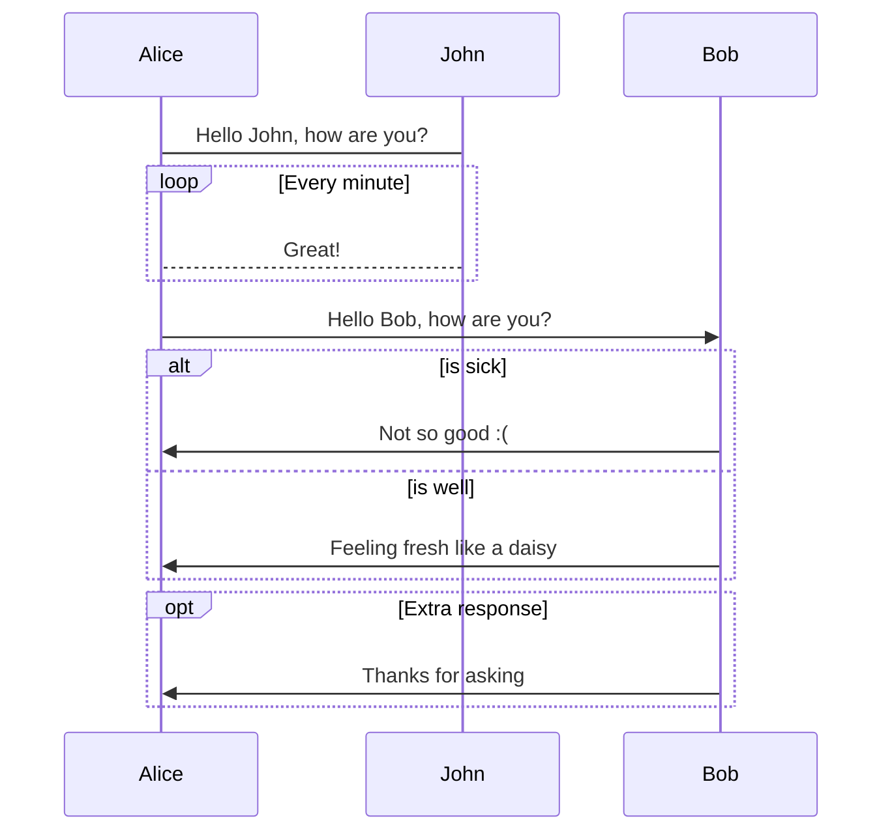
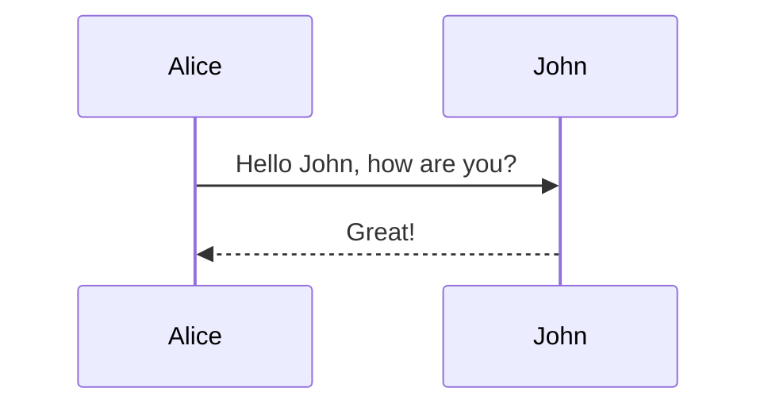

# Markdown cheatsheet

## 1. Formatting
```
_Italic_  
*Italic*  
__Bold__  
**Bold**  
_You **can** combine them_  
~~Strikethrough~~  
Example<sup>superscript</sup>  
Example<sub>subscript</sub>  
```
_Italic_  
*Italic*  
__Bold__  
**Bold**  
_You **can** combine them_  
~~Strikethrough~~  
Example<sup>superscript</sup>  
Example<sub>subscript</sub>


---
## 2. Lists

=== "Unordered lists"

    ```md
    - Unordered list
    + Unordered list
    * Unordered list
    - Nested
        - Unordered
        - List
    ```

    - Unordered list
    + Unordered list
    * Unordered list
    - Nested
        - Unordered
        - List

=== "Ordered lists"

    ```md
    1. Ordered list
    2. Ordered list
    3. Nested
       1. Ordered
       2. List
    ```

    1. Ordered list  
    2. Ordered list
    3. Nested
        1. Ordered
        2. List


---
## 3. Tasks

```md
+ [x] #tags, [links](), **formatting** supported
* [x] list syntax required (any unordered or ordered list supported)
- [x] this is a complete item
- [ ] this is an incomplete item
- [ ] tasks can be clicked in Preview to be checked off
	- [ ] nested tasks
```

+ [x] #tags, [links](), **formatting** supported
* [x] list syntax required (any unordered or ordered list supported)
- [x] this is a complete item
- [ ] this is an incomplete item
- [ ] tasks can be clicked in Preview to be checked off
	- [ ] nested tasks

---
## 4. Links

#### 4.1. External links

```md
<https://obsidian.md>   
<other@fake.mail>  
```

<https://obsidian.md>   
<other@fake.mail>  

#### 4.2. Internal links

```md
[Networking](<practical_ethical_hacking/peh-networking.md>)
```

[Networking](<practical_ethical_hacking/peh-networking.md>)

---
## 5. Images

#### 5.1. Local

```md

```


#### 5.2. Online

```md

```


---
## 6. Tables

```md
header 1|header 2|header 3
:---|:---:|---:
-|-|-
align left | center | align right
```

header 1|header 2|header 3
:---|:---:|---:
-|-|-
align left | center | align right

---
## 7. Math

```md
$\varphi^{\theta=2}_{3}$
$$\begin{vmatrix}a & b\\
c & d
\end{vmatrix}=ad-bc$$
$\frac{\frac{x}{1}}{x - y}$
```

$\varphi^{\theta=2}_{3}$
$$\begin{vmatrix}a & b\\
c & d
\end{vmatrix}=ad-bc$$
$\frac{\frac{x}{1}}{x - y}$

---
## 8. Blockquotes

```md
> Tu ne sais pas ce que le futur nous attend.

\- Massian Chakir, 2015
```

> Tu ne sais pas ce que le futur nous attend.

\- Massian Chakir, 2015

---
## 9. Code

#### 9.1. Inline code

```md
Text inside `backticks` on a line will be formatted like code.
```
++ctrl+alt+del++

Text inside `backticks` on a line will be formatted like code.

#### 9.2. Code blocks

    ``` python linenums="1" hl_lines="2 3"
    def bubble_sort(items):
        for i in range(len(items)):
            for j in range(len(items) - 1 - i):
                if items[j] > items[j + 1]:
                    items[j], items[j + 1] = items[j + 1], items[j]
    ```

``` python linenums="1" hl_lines="2 3"
def bubble_sort(items):
    for i in range(len(items)):
        for j in range(len(items) - 1 - i):
            if items[j] > items[j + 1]:
                items[j], items[j + 1] = items[j + 1], items[j]
```

#### 9.3. Indented text

```md
    Text indented with a tab is formatted like this, and will also look like a code block in preview.
```

    Text indented with a tab is formatted like this, and will also look like a code block in preview.

#### 9.4. Tabbed Codeblocks

    === "C"

        ``` c
        #include <stdio.h>

        int main(void) {
        printf("Hello world!\n");
        return 0;
        }
        ```

    === "C++"

        ``` c++
        #include <iostream>

        int main(void) {
        std::cout << "Hello world!" << std::endl;
        return 0;
        }
        ```

=== "C"

    ``` c
    #include <stdio.h>

    int main(void) {
      printf("Hello world!\n");
      return 0;
    }
    ```

=== "C++"

    ``` c++
    #include <iostream>

    int main(void) {
      std::cout << "Hello world!" << std::endl;
      return 0;
    }
    ```

---
## 10. Diagram

**Type**|**Description**
:---|:---
->|Solid line without arrow
-->|Dotted line without arrow
->>|Solid line with arrowhead
-->>|Dotted line with arrowhead
-x|Solid line with a cross at the end
--x|Dotted line with a cross at the end.
-)|Solid line with an open arrowat the end (async)
--)|Dotted line with a open arrow at the end (async)

#### Example 1 with notes :

    ```mermaid
    sequenceDiagram
        Alice->>+John: Hello John, how are you?
        Alice->>+John: John, can you hear me?
        John-->>-Alice: Hi Alice, I can hear you!
        John-->>-Alice: I feel great!
	    Note right of John: Text in note
	    Note over Alice,John: A typical interaction
    ```



#### Example 2 with loop and alt :

    ```mermaid
    sequenceDiagram
        Alice->John: Hello John, how are you?
        loop Every minute
            John-->Alice: Great!
        end
        Alice->>Bob: Hello Bob, how are you?
        alt is sick
            Bob->>Alice: Not so good :(
        else is well
            Bob->>Alice: Feeling fresh like a daisy
        end
        opt Extra response
            Bob->>Alice: Thanks for asking
        end
    ```



#### Parallel and background highlighting :

```md
Parallel :
par [Action 1]
... statements ...
and [Action 2]
... statements ...
and [Action N]
... statements ...
end

Background :
rect rgba(0, 0, 255, .1)
... content ...
end
```

#### Example with comments :

    ```mermaid
    sequenceDiagram
        Alice->>John: Hello John, how are you?
        %% this is a comment
        John-->>Alice: Great!
    ```



---
## 11. Admonition

```md
!!! note "Phasellus posuere in sem ut cursus"
    Lorem ipsum dolor sit amet, consectetur adipiscing elit. Nulla et euismod
    nulla. Curabitur feugiat, tortor non consequat finibus, justo purus auctor
    massa, nec semper lorem quam in massa.
```

!!! note "Phasellus posuere in sem ut cursus"
    Lorem ipsum dolor sit amet, consectetur adipiscing elit. Nulla et euismod
    nulla. Curabitur feugiat, tortor non consequat finibus, justo purus auctor
    massa, nec semper lorem quam in massa.

---
## 	$\infty$. Source 

[Writing Mathematic Fomulars in Markdown](<https://csrgxtu.github.io/2015/03/20/Writing-Mathematic-Fomulars-in-Markdown/>)  
[Obsidian official page : Format your notes](https://publish.obsidian.md/help/How+to/Format+your+notes)  
[Mermaid JS : Sequence Diagram](https://mermaid-js.github.io/mermaid/#/sequenceDiagram)  