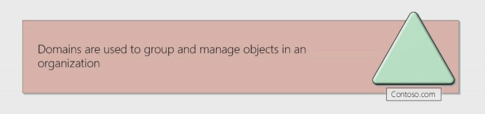
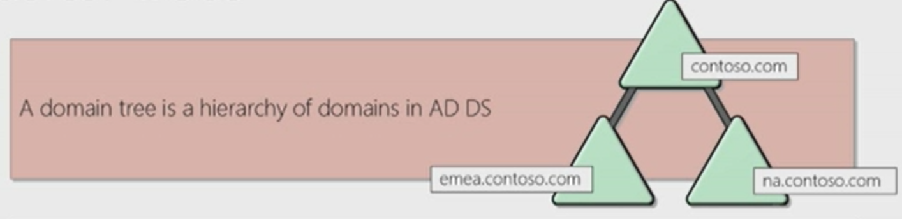
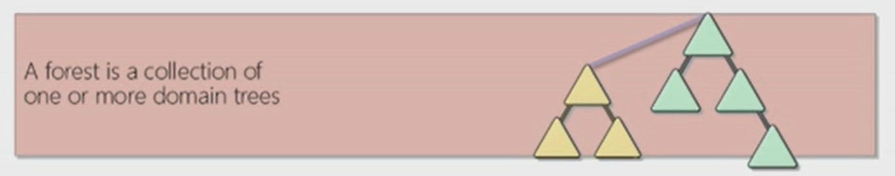
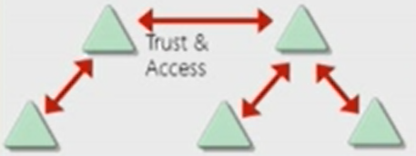

# Active Directory

## Overview

What :

- Developed by **Microsoft** for Windows domain networks management.
- Stores information related to objects (computers, users, printers...) : **Windows Phone Book**.
- Authenticates **Windows** devices using **Kerberos** tickets.
- Authenticated **non-Windows** devices via **RADIUS** or **LDAP**.

Why :

- **Most** commonly **used identity management service** in the world : 95% of Fortune 1000 use it.
- Can be **exploited without** ever attacking patchable **exploits** : instead **abuse features, trusts, components**...

## 1. Physical AD Components

#### Domain Controller:

*A domain controller is a server with the Active Directory Domain Services server role installed that has specifically been promoted to a domain controller.*

- Hosts a copy of the AD DS directory store ;
- Provide **authentication** and **authorization** services ;
- **Replicate** updates to **other domain controllers** in the domain and forest ;
- Allow **administrative access** to manage user accounts and network resources.  

#### Active Directory Domain Service Data Store:

*The AD DS data store contains the database files and processes that store and manage directoru information for users, services, and applications.*

- It is the `Ntds.dit` file ;
- Is stored by default in the %SystemRoot%\NTDS folder on all DC ;
- Is accessible only through the domain controller processes and protocols.

## 2. Logical AD Components

#### AD DS Schema

- Defines every type of object that can be stored in the directory
- Enforce rules regarding object creation and configuration

**Object Types**|**Function**|*Examples*
:-:|:-:|:-:
Class Object|What objects can be created in the directory|*User, Computer*...
Attribute Object|Information that can be attached to and object| *Display name*

#### Domains

*Domains are used to group and manage objects in an oragnization.*

- An administrative boundary for applying policies to groups of objects ;
- A replication boundary for replicating data between two domain controllers ;
- An authentication and authorization boundary that provides a way to limit to the scope of access to resources.

#### Trees

*A domain tree is a hierarchy of domains in AD DS.**

- Share a contiguous namespace with the parent domain
- Can have additional child domains
- By default create a two-way transitive trust with other domains

#### Forests

*A forest is a collection of one or more domain trees*

- Share a common schema
- Share a common configuration partition
- Share a common global catalog to enable searching
- Enable trusts between all domains in the forests
- Share the Entreprise Admins and Schema Admin groups

#### Organizational Units (OUs)

*OUs are Active Directory containers that can contain users, groups, computers, and other OUs*

- Represent your organization hierarchically and/or logically
- Manage a collection of objects in a consistent way
- Delegate permissions to administer groups of objects
- Apply policies

#### Trusts

*Trusts provide a mechanism for users to gain access to resources in another domain*

**Types of Trusts**|**Description**|**Diagram**
:-:|:-:|:-:
Directional|The trust direction flows from trusting domain to the trusted domain|
Transitive|The trust relationship is extended beyond a two-domain trust to include other trusted domains|

- All domains in a forest trust all other domains in the forest
- Trusts can extend outside the forest

#### Objects

**Object**|**Description**
:-:|:-:
User|Enables network resource access for a user
InetOrgPerson|Similar to a user account, used for compatibility with other 

*[DC]: Domain Controller