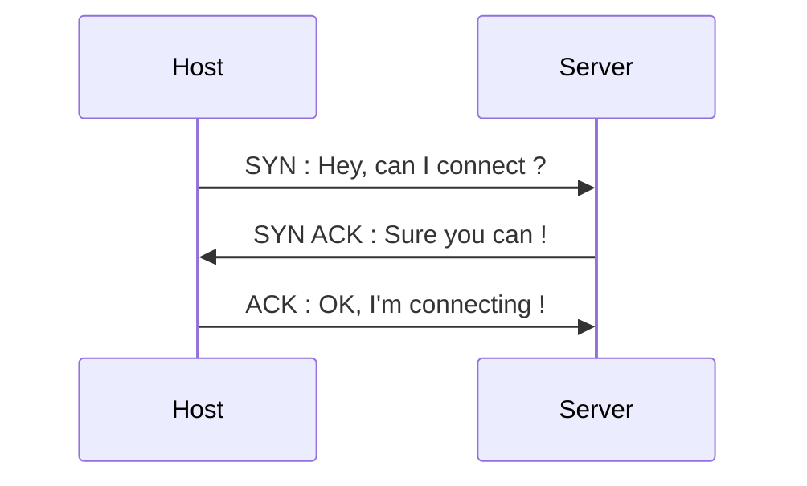
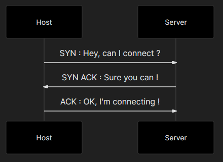
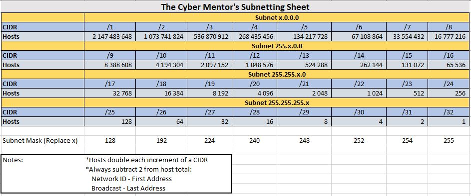

# Networking Refresher

## 1. IP Addresses

Display IP address in Linux : `$ ifconfig`  
We communicate over **Layer 3**  (***Router***)  
**NAT** $\to$ Network Address Translation  

### 1.2. Private IP addresses

**Network class**|**Network numbers**|**Network mask**|**Number of networks**|**Number of hosts per network**
:---:|:---:|:---:|:---:|:---:
Class A|**10**.0.0.0|255.0.0.0|126|16,646,144
Class B|**172.16**.0.0 to **172.32**.0.0|255.255.0.0|16,383|65,024
Class C|**192.168**.0.0 to 192.168.255.255|255.255.255.0|2,097,151|254
**Loopback**|127.0.0.1 to 127.0.0.7|255.255.255.255|-|-

## 2. MAC Addresses

**MAC** $\to$ Media Access Control  
**NIC** $\to$ Network Interface Card  

Mac address lookup : first 3 pairs are identifiers  
**Layer 2**, related to switching (***Switch***)  

## 3. TCP, UDP and the Three-Way Hanshake

**Layer 4**  
**TCP** $\to$ Transmission Control protocol  
**UDP** $\to$ User Datagram Protocol  

#### 3.1. TCP 3-way handshake
<!--

-->

## 4. Common ports and protocols

65,535 ports total $\to$ 1024 "**well-known**" ports  
**FTP** $\to$ File Transfer Protocol  
**Telnet** $\to$ Log remotely to a machine  
**SSH** $\to$ Secure SHell (encrypted telnet)  
**SMTP**, **IMAP**, **POP3** $\to$ all relate to mail  
**DNS** $\to$ Domain Name System  
**SMB** $\to$ File shares (*Samba*)  
**SNMP** $\to$ Simple Network Management Protocol  

!!! note ""
    === "TCP"
    
        Protocol | Port
        :-:|:-:
        FTP | 21
        SSH | 22
        Telnet | 23
        SMTP | 25
        DNS | 53
        HTTP | 80
        HTTPS | 443
        POP3 | 110
        SMB | 139 + 445
        IMAP | 143
        RDP | 3389
    
    === "UDP"
    
        Protocol | Port
        :-:|:-:
        DNS | 53
        DHCP | 67, 68
        TFTP | 69
        SNMP | 161

## 5. The OSI model

1. **Physical** $\to$ data, cables, cat6
2. **Data** $\to$ Switching, MAC addresses
3. **Network** $\to$ IP addresses, routing
4. **Transport** $\to$ TCP/UDP
5. **Session** $\to$ session management
6. **Presentation** $\to$ WMV, JPEG, MOV
7. **Application** $\to$ HTTP, SMTP

## 6. Subnetting
  
Subnetting Cybermentor Excel [Cheatsheet](files/Subnet-Guide.xlsx)

Link to site [IP Address Guide](<https://ipaddressguide.com>)

