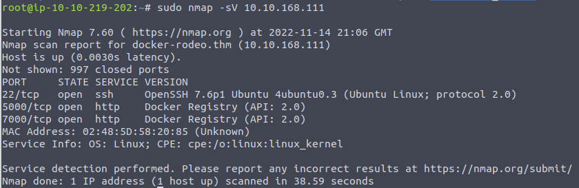
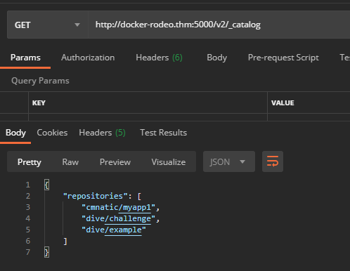
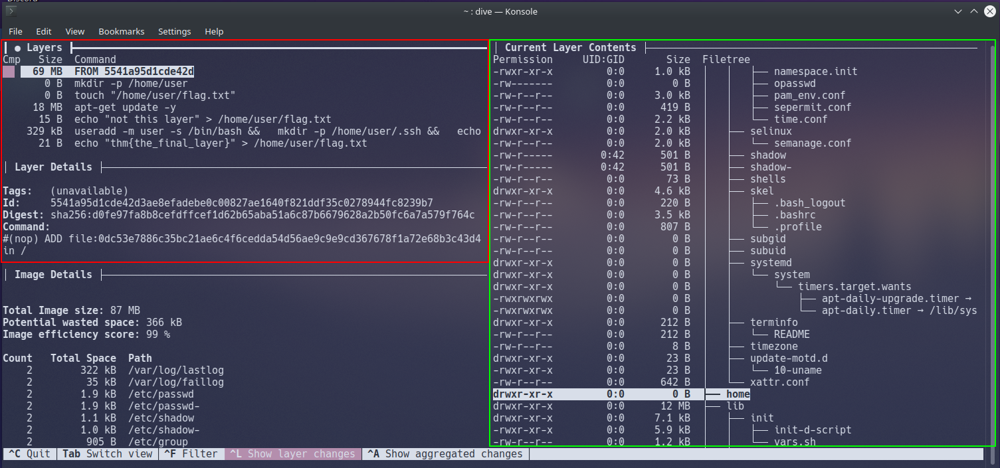

# Docker Pentesting

The Docker Rodeo room on TryHackMe

## 1. Intro to Docker

ok see later

## 2. Vulnerabilities

### 2.1. Abusing a Docker Registry

1. Discovery using Nmap

Common Docker Registry port is 5000 :

2. Query repositories using Postman

Docker Registry is a JSON endpoint --> *Postman*

[Full Docker Registry Documentation](<https://docs.docker.com/registry/spec/api/>)

We need to send a `GET` request to `http://<example.com>:5000/v2/_catalog` to list all the repositories registered on the registry.

*Note: `repository/name`*

3. Query tags of chosen app from repository

Send a `GET` request to `http://<example.com>:5000/v2/<repository>/<name>/tags/list` to query all published tags.

4. Get Manifest of chosen tag from chosen app from repository

Send `GET` request to `http://<example.com>:5000/v2/<repository>/<name>/manifests/<tag>`

5. Search in `history` for secrets ! :D

### 2.2. Reverse Engineering Docker Images

Using *Dive* [Github here](<https://github.com/wagoodman/dive>)

1. Install Dive
2. Get the image ID : `docker images`
3. Dive into the image : `dive <image_id>`

#### 2.2.1. Using Dive

Layers (pictured in red): This window shows the various layers and stages the docker container has gone through

Current Layer Contents (pictured in green): This window shows you the contents of the container's filesystem at the selected layer

Layer Details (pictured in red): Shows miscellaneous information such as the ID of the layer and any command executed in the Dockerfile for that layer.

Navigate the data within the current window using the "Up" and "Down" Arrow-keys.

You can swap between the Windows using the "Tab" key.